# Solicita

Sistema web para gerenciamento de solicitações internas.

## Tecnologias

### Backend

- Java 21
- Spring Boot
- Spring Security
- PostgreSQL
- Flyway
- Swagger

## Funcionalidades

- Autenticação
- Cadastro de solicitações
- Edição e exclusão
- Gerenciamento de status
- Filtros
- Dashboard

## Como executar

```bash
docker compose up -d
mvn spring-boot:run
```

## Arquitetura

A aplicação foi estruturada seguindo uma arquitetura em camadas, buscando separar responsabilidades e manter o código simples e adequado ao escopo do projeto.

Controller
↓
Service
↓
Repository
↓
PostgreSQL

As principais camadas são:

controller — responsável pela exposição dos endpoints HTTP, recebimento das requisições, validação dos dados de entrada e retorno das respostas.

service — concentra as regras de negócio da aplicação, como criação de solicitações, alteração de status e restrições para edição e exclusão.

repository — responsável pelo acesso e persistência dos dados utilizando Spring Data JPA.

entity — representa as entidades persistidas no banco de dados.

dto — define os dados utilizados na comunicação entre a API e seus consumidores, evitando expor diretamente as entidades.

security — concentra as configurações relacionadas à autenticação, sessão e autorização dos endpoints.

exception — centraliza as exceções de negócio e o tratamento das respostas de erro da API.

specification — encapsula a construção dinâmica dos filtros utilizados na consulta de solicitações.

config — concentra configurações gerais da aplicação, como inicialização de dados

## Decisões técnicas

Java 21 + Spring Boot — escolhidos para aproveitar recursos atuais da plataforma Java e o ecossistema do Spring para desenvolvimento de APIs REST. //melhorar tudo isso daqui, ver no manual como

Arquitetura em camadas — foi adotada uma separação entre controllers, services e repositories, mantendo as responsabilidades bem definidas sem adicionar abstrações desnecessárias para o escopo da aplicação.

PostgreSQL — utilizado como banco de dados relacional por se adequar ao modelo da aplicação, que possui relacionamentos bem definidos entre usuários e solicitações.

Flyway — utilizado para versionamento e gerenciamento das alterações do schema do banco de dados. Dessa forma, a estrutura do banco é criada e evoluída por meio de migrations versionadas.

JPA / Spring Data JPA — utilizado para simplificar o acesso aos dados e reduzir código de persistência repetitivo.

DTOs — utilizados para separar o modelo de persistência da representação dos dados expostos pela API. Foram utilizados também Java Records para DTOs imutáveis e concisos.

Bean Validation — utilizada para validar os dados recebidos pela API, como campos obrigatórios e limites de tamanho, evitando que entradas inválidas avancem para a camada de negócio.

Spring Security + autenticação baseada em sessão — utilizada para controlar o acesso aos endpoints e manter a sessão do usuário autenticado. A senha é armazenada utilizando BCrypt, nunca em texto puro.

Specifications — utilizadas para construir dinamicamente os filtros de solicitações, permitindo combinar critérios como título, categoria, status e período sem criar diversos métodos específicos no repository.

Tratamento global de exceções — foi implementado um GlobalExceptionHandler para centralizar o tratamento dos erros da API e manter respostas HTTP consistentes.

Testcontainers — utilizado nos testes de integração para executar uma instância real do PostgreSQL, evitando que os testes dependam de um banco instalado ou configurado manualmente na máquina.

Docker Compose — utilizado para facilitar a execução do PostgreSQL no ambiente de desenvolvimento, mantendo a configuração do banco reproduzível.

Sem Lombok — optou-se por não utilizar Lombok, mantendo as entidades JPA e demais classes explícitas e reduzindo dependências e comportamento implícito no projeto.

Sem Command Pattern — o padrão Command não foi utilizado porque as operações atuais possuem complexidade suficiente para serem representadas diretamente pelos métodos da camada de serviço. Adicionar uma camada de Commands neste momento aumentaria a complexidade sem um benefício concreto.

Swagger

## Testes

### Estratégia de testes

Os testes foram organizados em diferentes níveis. Testes unitários cobrem as regras de negócio da aplicação, enquanto testes de integração validam o fluxo completo entre controllers, serviços, persistência e PostgreSQL. Para os endpoints, foi adotada uma abordagem predominantemente black-box, verificando os comportamentos observáveis da API. Testes parametrizados foram utilizados em cenários com múltiplas entradas equivalentes, como categorias e status, buscando aumentar a cobertura sem duplicação desnecessária.

### Os testes unitários

#### Os testes unitários da camada de serviços cobrem:

- regras de criação e associação do usuário autenticado;
- consulta e tratamento de recursos inexistentes;
- regras de edição e exclusão de solicitações;
- alteração de status;
- paginação e limite máximo de requisições;
- mapeamento das entidades para DTOs;
- validação de diferentes categorias e status por meio de testes parametrizados.

### Os testes unitários

Os testes de integração validam o comportamento da aplicação em um ambiente próximo ao real, utilizando MockMvc para realizar requisições HTTP e Testcontainers para executar uma instância real do PostgreSQL.

São contemplados cenários como:

- autenticação e controle de sessão;
- criação, consulta, edição, alteração de status e exclusão de solicitações;
- validação de dados de entrada;
- aplicação dos filtros de pesquisa;
- funcionamento do dashboard;
- persistência e consulta dos dados no PostgreSQL.

## Demostração da API

### Tentando usar sem logar

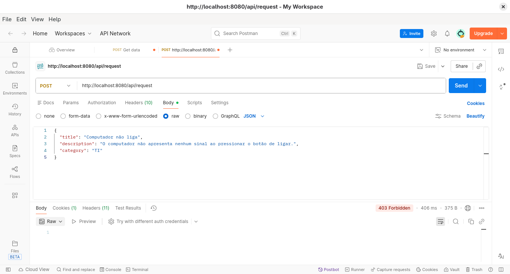

### Login

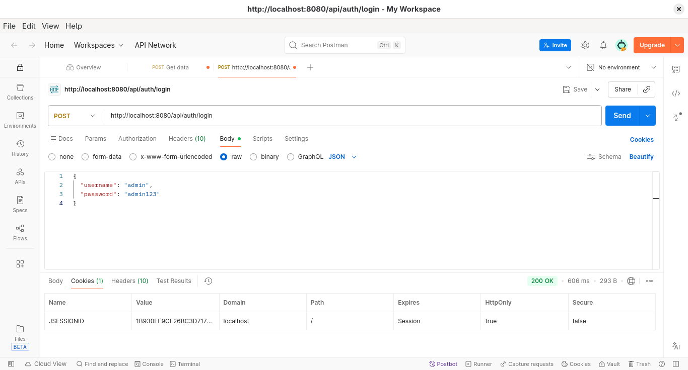

### Cria uma requisição para o TI

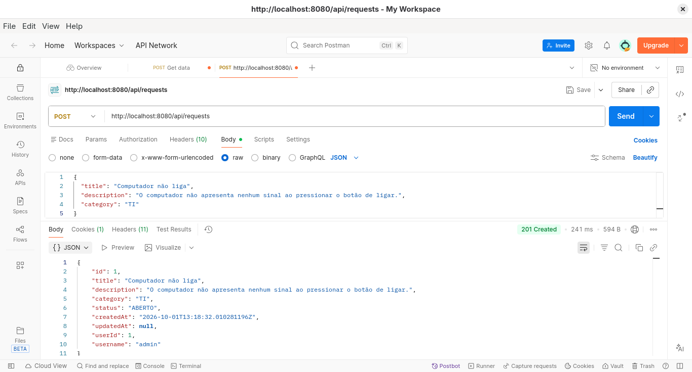

### Cria uma requisição para o RH

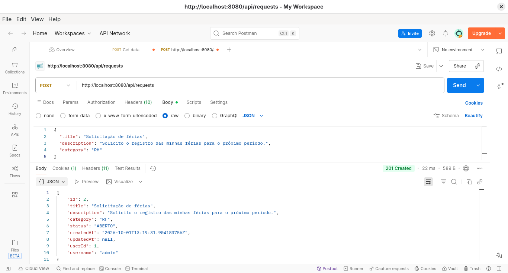

### Cria uma requisição para o Compras

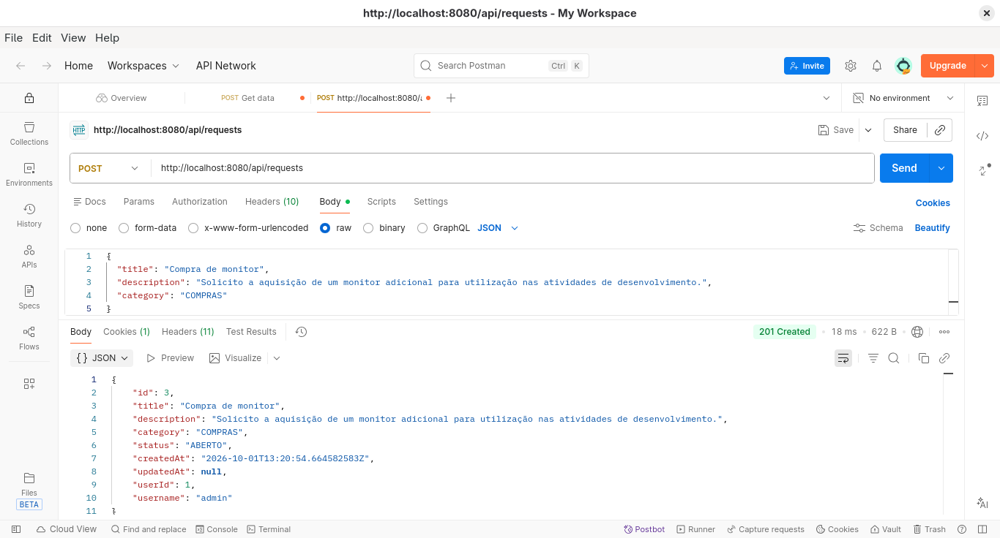

### Demostrando a persistência no banco de dados

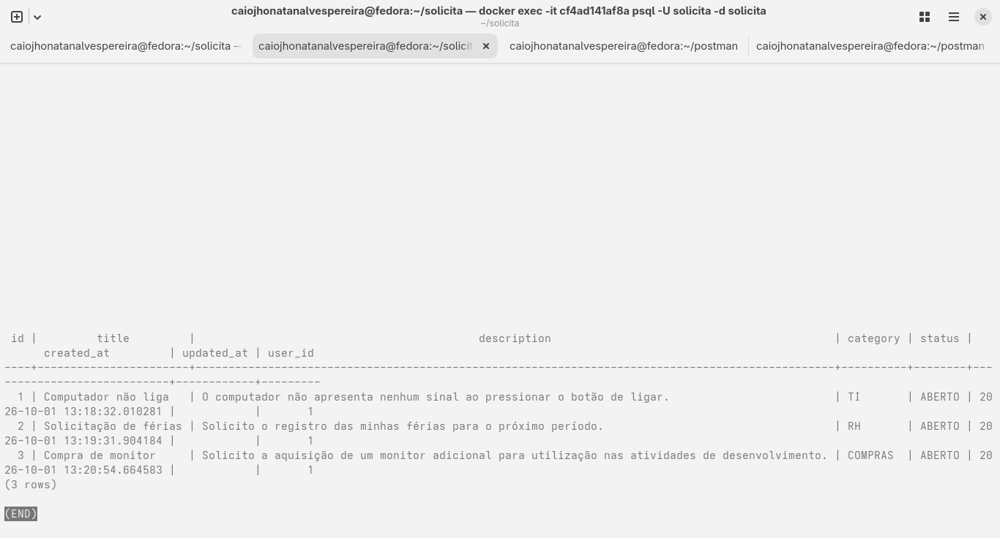

### Recuperar todos sem filtro

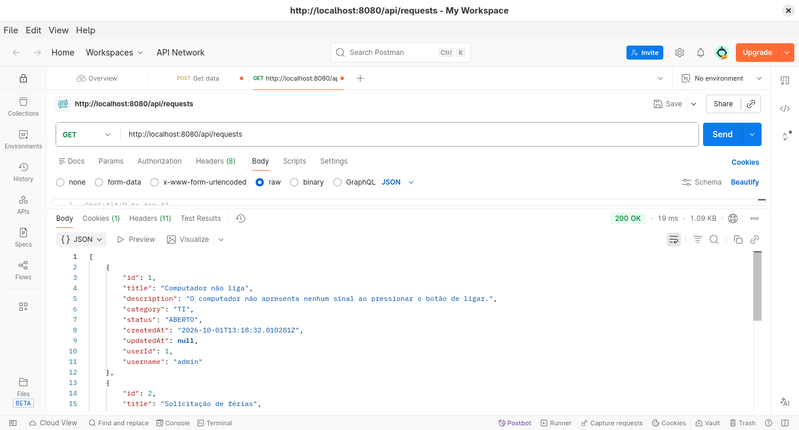

### Recuperar todos com filtro

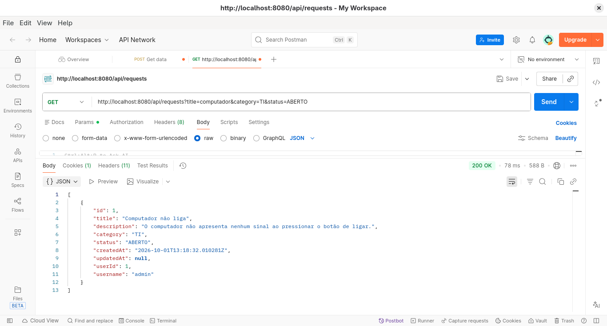

### Altera o status da requisição

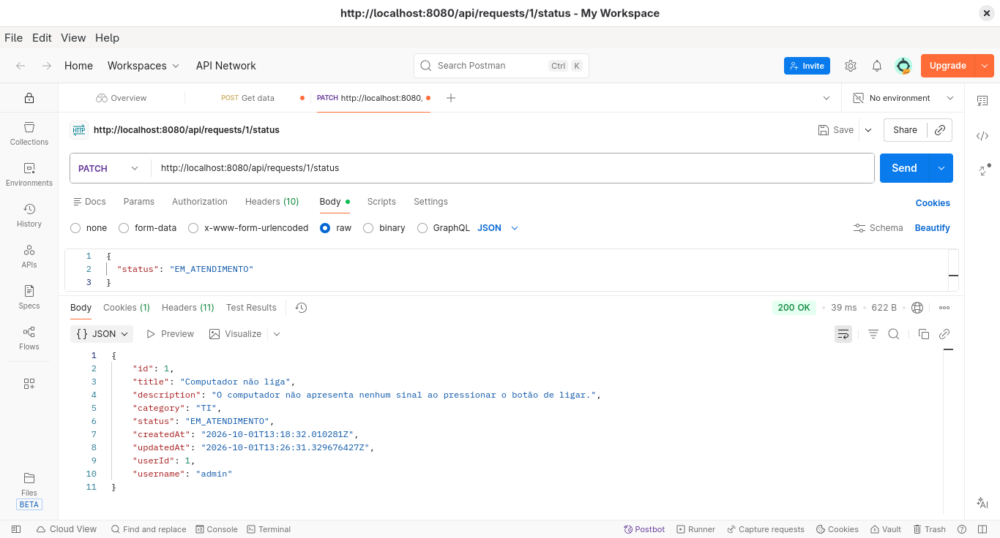

### Dashboard

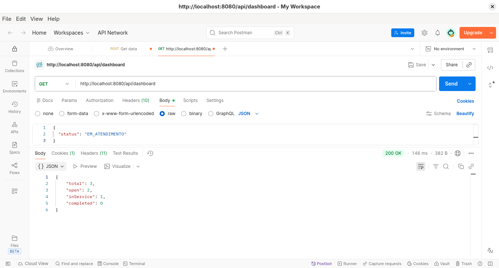

### Tratamento de exceções

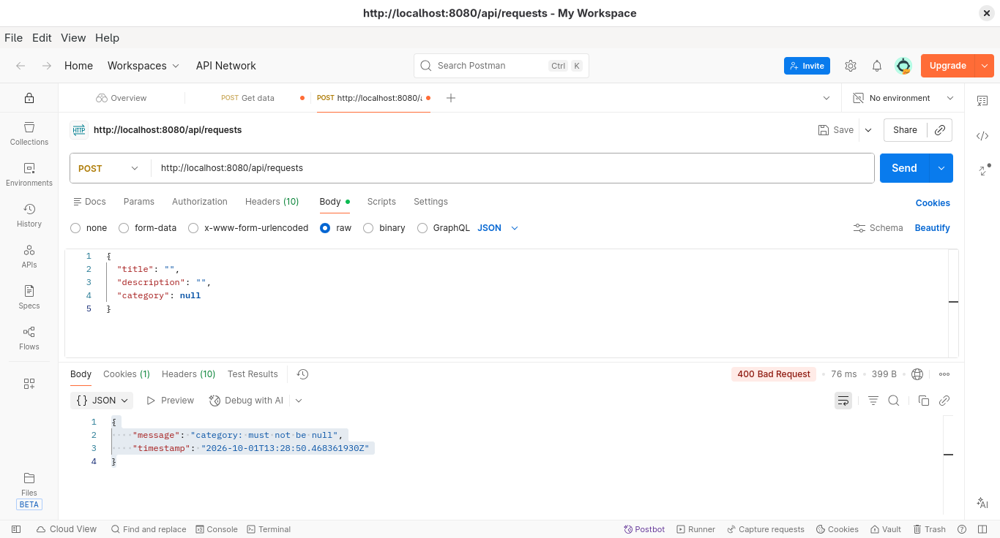

## Tabela de dados

| Tabela   | Campo       | Tipo         | Obrigatório | Descrição                    |
| -------- | ----------- | ------------ | ----------- | ---------------------------- |
| users    | id          | BIGSERIAL    | Sim         | Identificador do usuário     |
| users    | username    | VARCHAR(100) | Sim         | Nome de usuário              |
| users    | password    | VARCHAR(255) | Sim         | Senha armazenada com BCrypt  |
| requests | id          | BIGSERIAL    | Sim         | Identificador da solicitação |
| requests | title       | VARCHAR(150) | Sim         | Título da solicitação        |
| requests | description | TEXT         | Sim         | Descrição                    |
| requests | category    | VARCHAR(30)  | Sim         | Categoria                    |
| requests | status      | VARCHAR(30)  | Sim         | Status atual                 |
| requests | created_at  | TIMESTAMP    | Sim         | Data de criação              |
| requests | updated_at  | TIMESTAMP    | Não         | Data da última atualização   |
| requests | user_id     | BIGINT       | Sim         | Usuário solicitante          |
